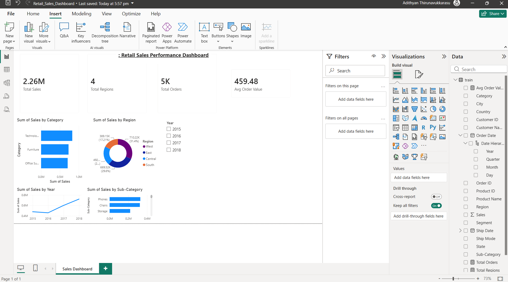

# Retail Sales Performance Dashboard — Power BI

An interactive business intelligence dashboard built in Power BI analysing retail sales performance across categories, regions, and time periods.

## Dashboard Preview



## Project Overview

This project demonstrates end-to-end dashboard development using Power BI — from raw data ingestion and transformation in Power Query, through DAX measure creation, to interactive visual design and business insight generation.

## Dataset

**Source:** Kaggle — Superstore Sales Dataset  
**Size:** 9,800+ transactions  
**Period:** 2015 – 2018  

| Column | Description |
|--------|-------------|
| Order ID | Unique order identifier |
| Order Date | Date of purchase |
| Ship Date | Date of shipment |
| Ship Mode | Shipping class (Standard, Second, First, Same Day) |
| Customer ID / Name | Customer details |
| Segment | Customer segment (Consumer, Corporate, Home Office) |
| Region | US sales region (East, West, Central, South) |
| Category | Product category (Furniture, Office Supplies, Technology) |
| Sub-Category | Product sub-category |
| Sales | Revenue per transaction |

## Tools & Technologies

| Tool | Purpose |
|------|---------|
| Power BI Desktop | Dashboard development and visualisation |
| Power Query | Data loading, cleaning, and transformation |
| DAX | Custom measures and KPI calculations |
| Kaggle | Dataset source |

## DAX Measures Created

```dax
Total Sales = SUM(train[Sales])

Total Orders = DISTINCTCOUNT(train[Order ID])

Avg Order Value = DIVIDE([Total Sales], [Total Orders], 0)

Total Regions = DISTINCTCOUNT(train[Region])
```

## Dashboard Features

### KPI Cards
- **Total Sales** — $2.26M revenue across all transactions
- **Total Orders** — 5K+ unique orders processed
- **Avg Order Value** — $459 average revenue per order
- **Total Regions** — 4 US sales regions covered

### Visualisations
- **Sales by Category** — Horizontal bar chart comparing Furniture, Office Supplies, and Technology
- **Sales by Region** — Donut chart showing regional revenue split (West leads at 31.4%)
- **Sales Trend by Year** — Line chart showing revenue growth from 2015 to 2018
- **Sales by Sub-Category** — Bar chart ranking all product sub-categories by revenue (Phones and Chairs lead)

### Interactive Features
- **Year Slicer** — Filter entire dashboard by year (2015, 2016, 2017, 2018)
- **Cross-filtering** — Click any visual to filter all others simultaneously

## Key Insights

- **Technology dominates** — highest revenue category despite fewer SKUs
- **West region leads** with 31.4% of total sales, followed by East at 29.6%
- **Revenue grew consistently** year-on-year from 2015 to 2018
- **Phones and Chairs** are the top-performing sub-categories
- **Standard Class shipping** is the most commonly used fulfilment method

## How to Use

1. Download `Retail_Sales_Dashboard.pbix`
2. Open in Power BI Desktop (free download at powerbi.microsoft.com)
3. Use the Year slicer to filter by time period
4. Click any chart segment to cross-filter the dashboard

## Project Structure

```
retail-sales-dashboard/
│
├── Retail_Sales_Dashboard.pbix   # Power BI file
├── train.csv                     # Raw dataset
├── dashboard_preview.png         # Dashboard screenshot
└── README.md
```

## Skills Demonstrated

- Power Query data cleaning and transformation
- DAX measure creation (SUM, DISTINCTCOUNT, DIVIDE)
- KPI dashboard design
- Interactive slicer and cross-filter implementation
- Business insight extraction from retail data
- Data visualisation best practices

## Author

**Adithyan Thirunavukkarasu**  
MSc Advanced Data Science & AI — University of Liverpool  
[LinkedIn](https://linkedin.com/in/adithyan-thirunavukkarasu) | [GitHub](https://github.com/adithyant-ds)
